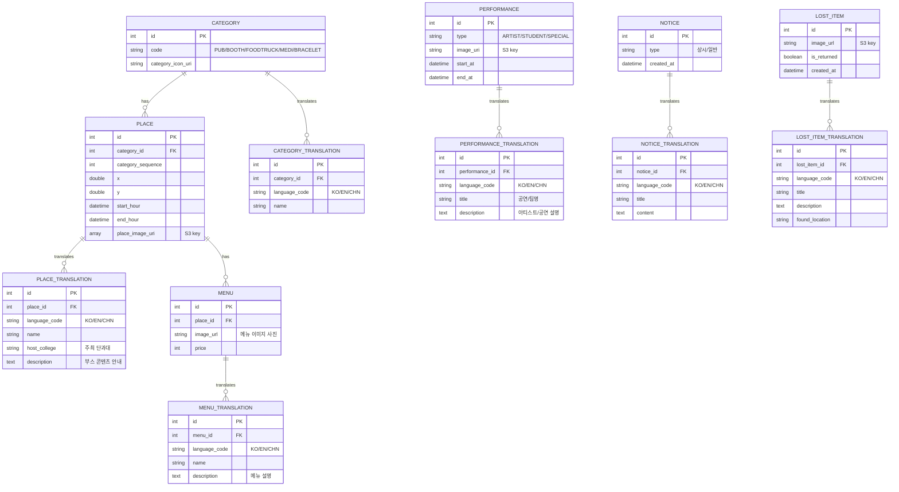

# QUINQUATRIA 2026 대동제 웹 PRD

> 이 파일은 팀 PRD **v0.2 (초안, 2026-09-06)** 를 저장소에 참고용으로 옮겨둔 것이다.
> §0~§12 는 원문 그대로다. 원문을 고치지 않는다.
> 읽다가 발견한 불일치는 원문에 섞지 않고 맨 뒤 **부록 A** 에만 적었다.
>
> **예외 — §6 ERD 는 2026-09-09 갱신분이다.** v0.2 원문에서 한 줄 달라졌다.
> `PERFORMANCE.image_uri "S3 key"` 가 추가됐다. 그 외는 v0.2 와 동일하다.
>
> **주의 — 스택은 확정이 아니다.** §8 의 프레임워크·API 선택은 팀에서 확정된 바 없다.
> 지금 이 문서에서 참고 기준으로 삼을 것은 **§6 ERD** 다. 부록 A-4 참조.

---

## 0. 문서 상태 요약

| 항목           | 값                                              |
| -------------- | ----------------------------------------------- |
| 버전           | v0.2 (초안)                                     |
| 작성일         | 2026-09-06                                      |
| 대상 축제      | 2026 하반기 QUINQUATRIA 대동제                  |
| 축제 일정      | 10/6\~8 중 이틀 (화·수·목), 오전 9\~10시경 시작 |
| 컨셉 키워드    | TWILIGHT                                        |
| 개발 완료 목표 | **9/30**                                        |
| 개발 방식      | **MVP 선 구현 → 이후 협의·수정**                |

---

## 1. 배경 · 목적

- **문제의식**: 에타·인스타 피드에서 축제 관련 중요 정보(쓰레기통 위치, 부스 안내 등)가 묻혀 접근성이 떨어짐.
- **핵심 목적**: 축제 정보를 한 곳에서 빠르게 확인할 수 있는 **정보 접근성 개선**.
- **1순위 가치**: 정보 전달 + 실시간 안내.
- **대상 사용자**: 축제 방문 학우 (모바일 중심).
- **제작 주체**: 멋쟁이사자처럼 HUFS(개발) × 총학생회(콘텐츠·운영·인프라).

---

## 2. 사용자 구분

### 서비스 사용자 (학생)

- 정보 조회 중심. 백엔드/DB에 직접 접근하지 않음 (정적·캐시 응답).

### 관리자 (학생회)

- 백오피스를 통한 정보 등록·수정·관리.
- 등록·수정 시 페이지 재생성(ISR) 또는 긴급 공지 전달(폴링) 트리거.
- 백엔드 쓰기는 원칙적으로 관리자만 발생시킴.

---

## 3. 데이터 흐름 대원칙

백엔드 상시 부하:

- 백오피스 쓰기(저빈도)
- 정적 재생성(저빈도)
- 사용자 읽기 트래픽은 CDN/정적에서 흡수
- 긴급 공지 폴링은 DB 직접 조회 (인덱스로 경량)
  - 경량화
    - 폴링이 새 긴급 공지를 DB에 물었을 때, 인덱스 룩업을 통한 쿼리 연산 시간 최소화
      - 긴급 공지는 온보딩 화면에서 가장 최신 공지 1개 Display
      - 별도의 버튼을 생성하여 누르면 긴급공지 전체 List 보여주기

---

## 4. 렌더링 전략

| 데이터             | 변동성                | 처리 방식                  | 백엔드 접근 시점              |
| ------------------ | --------------------- | -------------------------- | ----------------------------- |
| 축제 기본 정보     | 고정                  | 정적(SSG)                  | 없음 (빌드 시 포함)           |
| 부스·주점·푸드트럭 | 낮음                  | ISR                        | 백오피스 수정 시 재생성       |
| 공연 타임라인      | 낮음                  | SSG + 클라이언트 시각 판별 | 백오피스 수정 시 재생성       |
| 일반 공지          | 중간                  | ISR (이벤트 트리거)        | 백오피스 등록 시 재생성       |
| 긴급 공지 팝업     | 낮은 빈도·높은 즉시성 | 클라이언트 Short Polling   | 폴링(빈 응답)·등록 시 실 응답 |
| 분실물             | 낮음 (등록만)         | ISR                        | 백오피스 등록 시 재생성       |

---

## 5. 화면(페이지) 구조

### 5-1. 랜딩(홈) 페이지 — 간소화 확정

- 키비주얼 애니메이션 + 제작 크레딧 중심.
- 다른 페이지로 이동하는 **CTA/내비게이션을 명확히** 노출.
- 홈의 공지 캐러셀은 **제거**. 대신 신규 공지 등록 시 홈 접속 시점에 **일회성 팝업** 노출.
- 축제 전반 타임라인 / 공연 타임라인은 **별도 페이지**로 분리.

### 5-2. 타임라인 페이지 (별도)

- **축제 전반 타임라인**: 부스 개장·폐장 시간 등.
- **공연 타임라인**: 공연자/팀 라인업.
- **현재 공연 중인 팀을 강조** 노출.
- 학생 공연 중 **응원제·가요제**는 일반 공연과 디자인적으로 구분(전통·규모 있는 행사).

### 5-3. 지도 페이지

- 부스는 **구역+번호 체계**(A1, A2, B1…)로 표기, **ABCD 구역별 색 구분**.
- 지도 위 상시 표기 요소: 무대 / 쓰레기통 / 포토부스 / 학교 건물 / 팔찌 수령 장소(미네르바 컴플렉스 오바마홀) / 의무실
- 지도의 동적 수준 → 지도 API 사용, 좌표 값 필요 (x,y - 프론트에서 데이터 별도 전달)
  - https://react-leaflet.js.org/

### 5-4. 공지사항 페이지

- 피드 시간순 정렬 + **최상단 고정 공지** 강조(디자인 강조 필요).
  1. 상시
  2. 긴급
  3. 일반

### 5-5. 분실물 페이지

- 습득 분실물 목록 조회, 반환 여부 표시.

### 5-6. 백오피스 (관리자)

- 공지·타임라인·장소·분실물 등록/수정, 재생성 트리거, 모바일 등록 지원.

---

## 6. 데이터 모델 (ERD)

---

## 7. 기능별 요구사항 및 착수 가능 여부

각 기능에 **[착수 가능]** / **[부분 착수]** / **[블로커]**를 표기한다.

### 7-1. 축제 기본 정보 — [착수 가능]

- 정적 페이지. 실제 콘텐츠(일정·운영시간 확정값)는 필요하나, 페이지 골격·레이아웃은 즉시 착수 가능.

### 7-2. 공연 타임라인 — [착수 가능]

- 데이터 모델(PERFORMANCE)·페이지 구조·현재공연 판별 로직(클라이언트 시각 계산)은 착수 가능.
- **블로커**: 실제 라인업 데이터, 응원제/가요제 구분 디자인.
- 공연자 소개는 ARTIST 테이블(이름·설명)로 확정.

### 7-3. 장소 정보 (부스·주점·푸드트럭) — [착수 가능]

- PLACE/MENU 모델·목록·상세·지도 표기(구역+번호) 착수 가능.
- 위치표기는 좌표 정보로
- 푸드트럭은 정보량 적음(메뉴·설명·운영시간까지만).

### 7-4. 위치 정보 (편의 시설) — [착수 가능]

- 쓰레기통·의무실·무대·포토부스·팔찌 수령 장소 등.
- **결정**: 안 바뀌는 고정 정보이므로 **정적 페이지/정적 마커로 처리**(별도 테이블 불필요).

### 7-5. 공지사항 (일반) — [논의 필요 - 다국어 이슈]

- NOTICE 모델·목록·고정 공지 강조·ISR(revalidatePath) 구조 착수 가능.

### 7-6. 긴급 공지 팝업 — [논의 필요]

- Short Polling 방식. `(is_urgent, created_at)` 인덱스, 조건부 빈 응답 설계.
- 홈 접속 시 일회성 팝업(회의록 반영).
- 푸시 알림은 미채택(웹푸시 iOS PWA 설치 제약 등).

### 7-7. 분실물 — [착수 가능]

- LOST_ITEM 모델·목록·이미지(S3)·ISR 구조 착수 가능.

### 7-8. 백오피스 — [착수 가능]

- 관리자 인증, 등록/수정/삭제, 재생성 트리거, 모바일 등록.

### 7-9. 다국어 (한/영/중) — [부분 착수]

- **확정**: 일본어 제외, 한국어·영어·중국어 3개국어.
- **확정**: 공지·분실물은 **학생회가 3개국어로 직접 업로드**(번역 기능 아님).
- **미해결**: **부스 정보 번역 처리 방식** — 학생회 직접 입력인지, 웹 언어변경 대상인지 미결: `________`
- 웹 자체 언어변경은 그 외 UI 텍스트에 적용.

### 7-10. 응원가 미리듣기 — [보류/블로커]

- 회의록 제안(응원제 부흥 취지, 작게).
- **블로커**: 저작권 확인(원곡 기반 여부, 웹 BGM 사용 가부) → 학생회 확인 필요: `________`
- 자동재생 불가(브라우저 정책) → 사용자 버튼 재생 전제. 우선순위 낮음.

---

## 8. 기술 · 인프라

- **프론트**: Next.js 계열 (SSG/ISR + 클라이언트 폴링) + Vite React
- **백엔드**: FastAPI
- **DB**: PostgreSQL? → Gin 츄라이
- **이미지 스토리지**: S3 + CloudFront(CDN).
- **배포/호스팅**: AWS

### 인프라 블로커 (총학 확인 대기)

- **서버·인프라 비용 지원 규모 / 인스턴스 타입 상한**: 20만원 / medium
- 도메인 : Cloudflare
- **예상 동시 접속 규모**(배포·부하 설계 기준):

---

## 9. 착수 블로커 종합 (해소 전 진행 불가)

### 9-1. 지도 동적 수준 — [디자인·프론트 협의]

- 지도를 어느 수준까지 동적으로 구현할지 미정. 위치 데이터는 구역+번호로 확정됐으므로 백엔드 필드는 확정 가능하나, **지도 UI의 동적 표현 수준**은 협의 필요.
- 필요: 캠퍼스 맵 원본 이미지/에셋 `________`, 동적 수준 합의 `________`

### 9-2. 콘텐츠·데이터

- 부스·주점·푸드트럭 총 규모(개수): `________`
- 콘텐츠 최종 데이터 마감일: `________`
- 실제 공연 라인업·공연자 소개: `________`

### 9-3. 디자인

- 키비주얼·컨셉(TWILIGHT) 톤앤매너 확정: `________`
- 와이어프레임 v0.1 이후 확정본: `________`
- 학생회 디자이너 협업 범위: `________`

### 9-4. 인프라·정책

- 서버 비용·인스턴스 상한 / 도메인 / 배포 방식: §8 참조.

### 9-5. 운영·일정

- 배포 기간(축제 전 n일 오픈 / 후 m일 유지): `________`
- 백오피스 운영 주체·권한 분리: `________`
- 정기 회의로 확정할 마일스톤: `________`

---

## 10. 작업 우선순위 (제안)

> 원칙: **MVP 선 구현**. 블로커 없는 핵심 정보 기능부터. 데이터 의존 기능은 모델·화면을 먼저 만들고 실데이터는 나중에 주입. **개발 완료 목표 9/30.**

### P0 — 즉시 착수 (블로커 없음)

- 공지사항(일반) 모델·페이지·ISR 파이프라인
- 긴급 공지 Short Polling + 홈 일회성 팝업
- 분실물 모델·페이지
- 백오피스 기본 골격(인증·CRUD·재생성 트리거)
- 랜딩 페이지 골격(간소화 구조·내비게이션)
- 편의시설 정적 마커 페이지
- **장소 정보(PLACE/MENU) 모델·목록·상세** (위치 구역+번호 확정, 품절 제외로 블로커 해소)
- **ARTIST 테이블 포함 공연 타임라인 모델·페이지** (현재공연 판별 로직)

### P1 — 모델·화면 선착수, 실데이터/디자인 대기

- 지도 표기(구역+번호) 연동 — 지도 UI 동적 수준 협의(§9-1)와 병행
- 공연 타임라인 실 라인업 주입, 응원제/가요제 구분 디자인
- 다국어 프레임(한/영/중) UI 골격

### P2 — 블로커 해소 후

- 지도 동적 구현 심화 (§9-1)
- 부스 정보 번역 처리(§7-9 결정 후)

### P3 — 선택/보류

- 응원가 미리듣기(저작권 확인 후)

---

## 12. 열린 질문 (다음 회의 안건)

1. 부스 정보(설명 등)의 3개국어 번역은 누가 어떻게 입력하는가?
2. 지도 UI를 어느 수준까지 동적으로 구현할 것인가? (캠퍼스 맵 에셋 확보 포함)
3. PERFORMANCE type에 응원제·가요제 구분을 어떻게 반영할 것인가?
4. 응원가 미리듣기의 저작권 사용 가부?

---

# 부록 A. 확인 필요 — 원문 아님

여기부터는 PRD 원문이 아니다. v0.2 를 옮기며 발견한 **문서 내부 불일치와 미확정 사항**을 모아둔 것이다.
원문 §0~§12 는 손대지 않았으므로, 아래 항목이 정리되면 원문 쪽을 v0.3 으로 갱신해야 한다.

## A-1. ARTIST 테이블이 ERD 에 없다

§7-2 는 "공연자 소개는 ARTIST 테이블(이름·설명)로 확정" 이라 적고,
§10 P0 도 "**ARTIST 테이블 포함** 공연 타임라인 모델·페이지" 를 즉시 착수 대상으로 올린다.

그런데 §6 ERD 에 `ARTIST` 엔티티가 없다. 공연자 이름·설명은 `PERFORMANCE_TRANSLATION`
의 `title` (공연/팀명) 과 `description` (아티스트/공연 설명) 이 대신 들고 있다.

두 갈래 중 하나로 정해야 한다.

- ERD 가 맞다 → §7-2·§10 의 "ARTIST 테이블" 문구를 걷어낸다. 한 아티스트가 여러 공연을
  하더라도 공연마다 설명을 중복 입력하게 된다.
- §7-2 가 맞다 → ERD 에 `ARTIST` + `ARTIST_TRANSLATION` 을 넣고 `PERFORMANCE` 가
  이를 참조하도록 고친다. 다국어 구조상 번역 테이블이 한 쌍 더 늘어난다.

2026-09-09 갱신에서 `PERFORMANCE.image_uri` 가 추가됐다. 공연자 사진을 `PERFORMANCE`
가 직접 들게 됐으므로 첫 갈래(ERD 가 맞다) 쪽으로 기운 것으로 읽힌다. 다만 §7-2·§10 의
문구는 그대로라 여전히 정리가 필요하다.

## A-2. NOTICE 에 "긴급" 이 없다

세 곳이 서로 다르게 말한다.

| 위치                 | 공지 종류                    | 긴급 판별                             |
| -------------------- | ---------------------------- | ------------------------------------- |
| §5-4                 | 상시 · **긴급** · 일반 (3종) | —                                     |
| §6 ERD `NOTICE.type` | 상시 / 일반 (2종)            | 필드 없음                             |
| §7-6                 | —                            | `(is_urgent, created_at)` 인덱스 전제 |

ERD 에는 `긴급` 타입도 `is_urgent` 필드도 없어서, §7-6 이 설계 근거로 삼는 인덱스를
지금 스키마로는 만들 수 없다. 긴급 공지 폴링(§3·§4·§7-6)이 이 PRD 의 핵심 동작 중
하나이므로 우선 정리 대상이다.

정하는 방식 자체도 갈린다. `type` 에 `긴급` 을 추가할지, `type` 과 별개로 `is_urgent`
불리언을 둘지에 따라 인덱스와 쿼리가 달라진다.

## A-3. §7-5 의 상태가 §10 과 어긋난다

§7-5 공지사항(일반)은 **[논의 필요 - 다국어 이슈]** 로 표시돼 있는데,
§10 P0 는 "즉시 착수 (**블로커 없음**)" 목록 첫 줄에 같은 항목을 올려놨다.

다만 §7-9 에서 "공지·분실물은 학생회가 3개국어로 직접 업로드" 가 **확정**으로 적혀 있어,
§7-5 의 다국어 이슈는 이미 해소된 것으로 보인다. 그렇다면 §7-5 의 태그를
[착수 가능] 으로 내리는 것이 맞다. 확인 필요.

## A-4. §8 기술 스택은 확정이 아니다

**팀 확인 결과: 프레임워크와 API 는 확정된 바 없다. 현 시점 참고 기준은 §6 ERD 다.**

§8 에 적힌 값들은 확정 결정이 아니라 후보로 읽어야 한다. 문서 자체도 미확정 표기를
남기고 있다 — DB 는 "PostgreSQL? → Gin 츄라이", 예상 동시 접속 규모는 빈칸이다.

저장소 문서와도 어긋난다. `web/CLAUDE.md` 는 "DB 접근·인증·비즈니스 규칙은 전부 외부
**Django**" 라고 적고 있으나 §8 은 **FastAPI** 다. 어느 쪽도 확정이 아니므로,
스택이 정해지기 전까지 `CLAUDE.md` 의 Django 표기를 근거로 삼지 않는다.

확정 전까지 지켜야 할 선은 백엔드 프레임워크와 무관하게 유효하다 — Next.js 안에
DB 접근·인증·비즈니스 규칙을 넣지 않는다. 백엔드는 외부에 둔다.

## A-5. 사소한 것

- 절 번호가 §10 다음 §12 로 건너뛴다. §11 이 없다.
- §9-4 는 내용 없이 §8 을 가리키는데, §8 의 인프라 블로커 중 "예상 동시 접속 규모" 만
  아직 빈칸이다. 비용(20만원/medium)과 도메인(Cloudflare)은 값이 채워져 있다.
- 이미지 필드 이름이 `_uri` 와 `_url` 로 갈린다. 값은 모두 S3 키인데
  `CATEGORY.category_icon_uri` · `PLACE.place_image_uri` · `PERFORMANCE.image_uri` 는
  `_uri`, `MENU.image_url` · `LOST_ITEM.image_url` 은 `_url` 이다. 한쪽으로 통일하는 게 좋다.

## A-6. 확인된 사항 (참고)

- 축제 일정 "10/6~8 중 이틀 (화·수·목)" 의 요일 표기는 맞다.
  2026-10-06 화요일, 10-07 수요일, 10-08 목요일. 다만 사흘 중 **어느 이틀**인지는 미정.
- 개발 완료 목표 **9/30** 은 축제 시작(10/6) 엿새 전이다.
